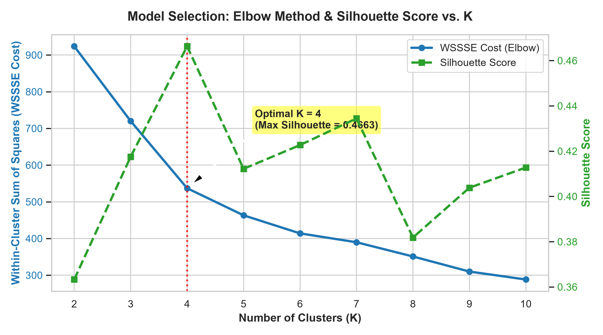
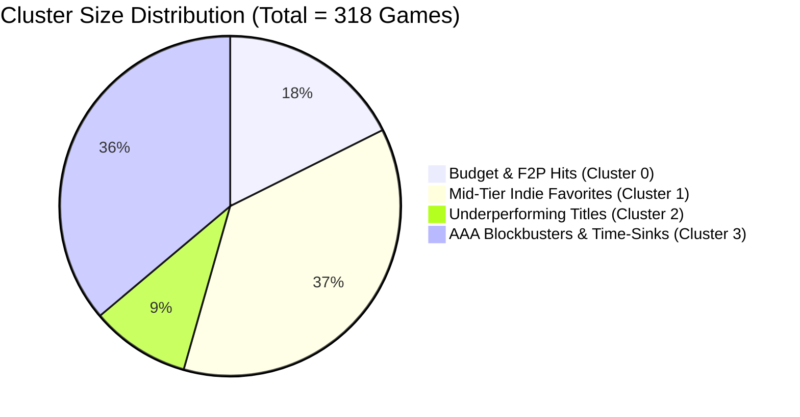
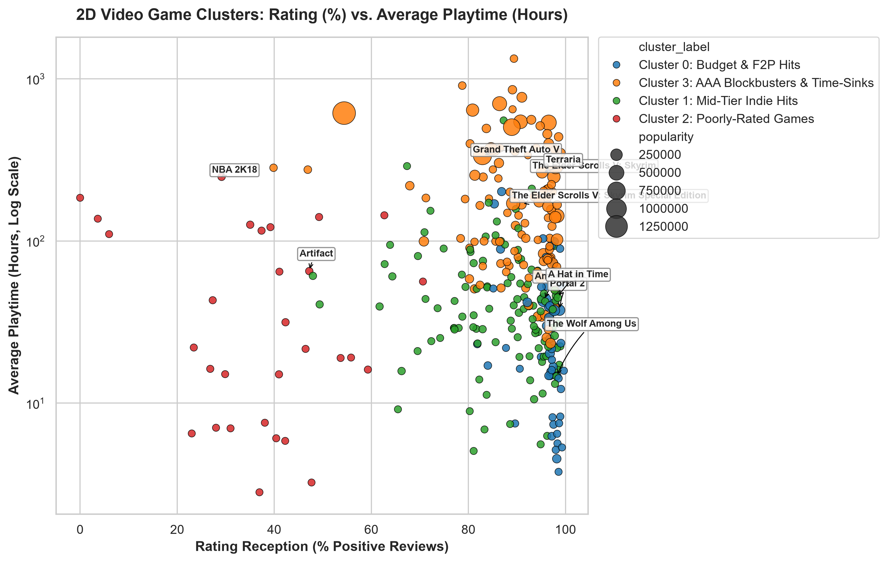
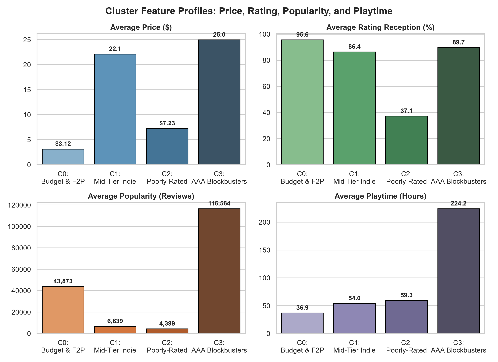
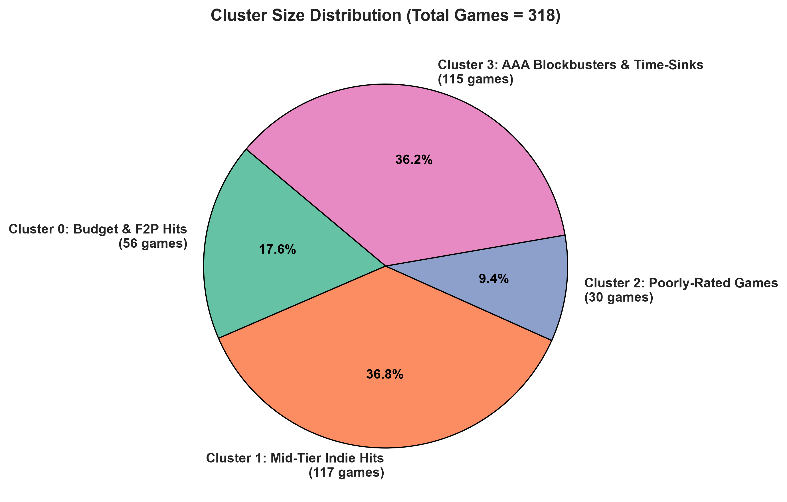

# Video Game Clustering Analysis — Cluster Interpretation & Inference Report

**Project Title:** Video Games Clustering Based on Price, Rating, Popularity, and Playtime Using K-Means  
**Domain:** Big Data Machine Learning & Game Commercial Analytics  

---

## 1. Data Verification & Quality Check

All exported summary tables and clustered data from the Big Data PySpark pipeline have been validated:

| Metric / Table | Source File | Value / Status | Verification Notes |
|---|---|---|---|
| **Raw Processed Records** | `najzeko/steam-reviews-2021` | **40,848,659 reviews** | Cleaned & aggregated with PySpark |
| **Total Games in ML Table** | `exports/clustered_games.csv` | **318 games** | Aggregated by `app_id` with joined metadata |
| **Clustering Features** | `price`, `rating_percent`, `popularity`, `playtime_hours` | **4 Features** | Normalized using `log1p` + `StandardScaler` |
| **Optimal K** | `exports/elbow_cost.csv` | **$K = 4$** | Supported by Elbow point & peak Silhouette |
| **Final WSSSE Cost** | `exports/elbow_cost.csv` | **537.02** | Significant cost drop from $K=2$ (923.85) |
| **Final Silhouette Score** | `exports/elbow_cost.csv` | **0.4663** | Strongest separation across $K \in [2, 10]$ |

---

## 2. Model Selection & Evaluation Visualizations

### 2.1. Elbow Curve & Silhouette Score Analysis


* **Elbow Curve (WSSSE Cost):** Cost drops sharply from $K=2$ ($923.85$) to $K=4$ ($537.02$), showing diminishing returns for $K > 4$.
* **Silhouette Score:** Reaches a global maximum at **$K = 4$ ($0.4663$)**, indicating the best balance between intra-cluster cohesion and inter-cluster separation.

```
K = 2: WSSSE = 923.85, Silhouette = 0.3633
K = 3: WSSSE = 719.91, Silhouette = 0.4176
K = 4: WSSSE = 537.02, Silhouette = 0.4663  <-- OPTIMAL
K = 5: WSSSE = 463.13, Silhouette = 0.4122
K = 6: WSSSE = 413.94, Silhouette = 0.4227
```

---

## 3. Discovered Cluster Profiles & Measurable Characteristics

| Cluster ID | Semantic Cluster Name | Game Count (%) | Mean Price (Median) | Mean Rating (Median) | Mean Popularity (Median) | Mean Playtime (Median) |
|:---:|:---|:---:|:---:|:---:|:---:|:---:|
| **Cluster 0** | **Budget & Free-to-Play Mass Hits** | 56 (17.6%) | \$3.12 (\$0.00) | 95.63% (97.16%) | 43,873 (29,982) | 36.91 h (21.63 h) |
| **Cluster 1** | **Mid-Tier & Niche Indie Favorites** | 117 (36.8%) | \$22.10 (\$18.99) | 86.41% (89.76%) | 6,639 (4,570) | 53.95 h (38.48 h) |
| **Cluster 2** | **Underperforming / Poorly-Received Titles** | 30 (9.4%) | \$7.23 (\$0.00) | 37.15% (38.06%) | 4,399 (2,860) | 59.31 h (21.60 h) |
| **Cluster 3** | **AAA Blockbusters & High-Engagement Time-Sinks** | 115 (36.2%) | \$24.96 (\$22.99) | 89.69% (91.82%) | 116,564 (53,546) | 224.23 h (156.36 h) |

---

## 4. In-Depth Cluster Interpretations & Representative Games



### 🏷️ Cluster 0: Budget & Free-to-Play Mass Hits
* **Characteristics:** Extremely low barrier to entry (average price \$3.12, median \$0.00), exceptional player satisfaction (95.63% positive reviews), and high viral popularity (~43.9k reviews). Playtime is moderate (~37 hours).
* **Representative Games:**
  - *Among Us* (\$3.99, 95.65% rating, 395,236 reviews, 43.2h playtime)
  - *Papers, Please* (\$6.99, 96.84% rating, 28,570 reviews, 14.7h playtime)
  - *BattleBlock Theater* (\$10.99, 97.30% rating, 44,731 reviews, 22.8h playtime)
  - *Saints Row: The Third* (\$6.99, 96.12% rating, 44,793 reviews, 52.6h playtime)

### 🏷️ Cluster 1: Mid-Tier & Niche Indie Favorites
* **Characteristics:** Premium indie pricing (\$15 - \$30 range, avg \$22.10), strong positive reception (86.41%), modest but dedicated review base (~6.6k reviews), and focused engagement (avg 54 hours).
* **Representative Games:**
  - *Night in the Woods* (\$14.99, 95.70% rating, 6,769 reviews, 24.0h playtime)
  - *Danganronpa: Trigger Happy Havoc* (\$14.99, 97.53% rating, 11,638 reviews, 36.8h playtime)
  - *Overcooked! 2* (\$19.99, 90.40% rating, 20,717 reviews, 36.1h playtime)
  - *Trailmakers* (\$19.49, 90.37% rating, 4,570 reviews, 76.2h playtime)

### 🏷️ Cluster 2: Underperforming & Poorly-Received Titles
* **Characteristics:** Severely low user reception (mean 37.15%, median 38.06%), low total review volume (~4.4k reviews), and mostly low or discounted pricing. Playtime median is low (21.6 hours), though heavily inflated by a few sports/multiplayer outliers.
* **Representative Games:**
  - *NBA 2K21* (\$0.00 / free weekend/promotional, 35.04% rating, 13,264 reviews, 125.9h playtime)
  - *Deus Ex: The Fall* (\$7.99, 30.99% rating, 1,965 reviews, 7.0h playtime)
  - *Identity* (\$23.79, 23.00% rating, 1,187 reviews, 6.5h playtime)

### 🏷️ Cluster 3: AAA Blockbusters & Endless Time-Sinks
* **Characteristics:** Premium price tag (mean \$24.96, median \$22.99), massive review counts (mean 116,564 reviews), high positive reception (89.69%), and extraordinary average playtime (224.23 hours, median 156.36 hours).
* **Representative Games:**
  - *The Elder Scrolls V: Skyrim* (\$9.99, 95.17% rating, 227,180 reviews, 264.5h playtime)
  - *Monster Hunter: World* (\$49.99, 85.32% rating, 226,538 reviews, 363.6h playtime)
  - *Factorio* (\$21.00, 99.03% rating, 80,198 reviews, 349.7h playtime)
  - *Cities: Skylines* (\$22.99, 93.61% rating, 113,205 reviews, 187.9h playtime)
  - *The Forest* (\$15.49, 94.75% rating, 182,373 reviews, 59.5h playtime)

---

## 5. Visualizations Gallery

### 5.1. 2D Cluster Scatter Plot (Rating % vs. Playtime Hours)


### 5.2. Cluster Feature Comparison Bar Charts


### 5.3. Cluster Distribution


---

## 6. Written Inferences & Strategic Insights

1. **Price is Not a Direct Determinant of Player Satisfaction:**
   - Cluster 0 (Budget/F2P) has the highest average rating (95.63%), outperforming even full-priced AAA games in Cluster 3 (89.69%). Accessible pricing combined with polished gameplay creates exceptionally positive player sentiment.
2. **Engagement Separates Blockbusters from Casual Hits:**
   - While Cluster 0 and Cluster 3 both enjoy viral popularity, Cluster 3 titles generate over $6\times$ higher average playtime ($224.2\text{ h}$ vs $36.9\text{ h}$), driven by modding communities (*Skyrim*), sandbox mechanics (*Factorio*, *Cities: Skylines*), and grind-heavy multiplayer loops (*Monster Hunter*).
3. **The "Review Penalty" for Annual Franchises & Port Failures:**
   - Cluster 2 highlights games that suffered technical issues, aggressive monetization, or poor porting (e.g. *NBA 2K21*, *Deus Ex: The Fall*), resulting in steep review drops below 40% positive sentiment.

---

## 7. Project Limitations & Nuances

* **Review Count as Popularity Proxy:** Review volume reflects community engagement and willingness to review, not concurrent active player count.
* **Review Sentiment Bias:** Players with extreme opinions (very satisfied or frustrated) are significantly more likely to leave reviews than moderate players.
* **Price Dynamics & Sales:** Metadata reflects standard listing prices; historical seasonal sales, bundles, or promotional giveaways (e.g., free weekends) are not fully captured.
* **Game Age & Playtime Accumulation:** Older games (e.g., *Skyrim* released in 2011) have had over a decade to accumulate total playtime and reviews compared to newer releases.
* **Corrupted Playtime Outliers:** Aggregation required strict filtering ($\le 10,000$ hours) to eliminate corrupted Steam timestamp records.
